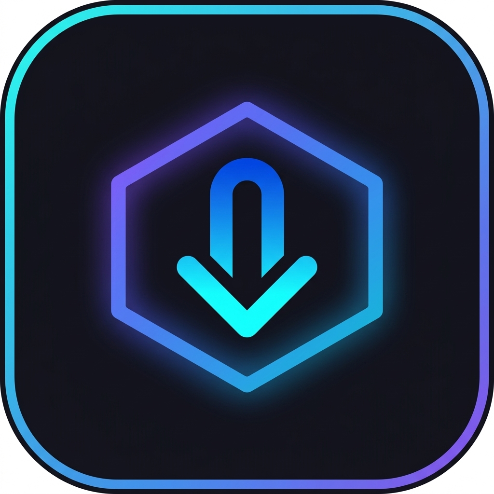

  
  <h1>OmniDL</h1>
  
Téléchargez des vidéos et musiques depuis n'importe quel lien.

  
  &nbsp;
  

---

## Téléchargement

Allez dans **[Releases](../../releases/latest)** et téléchargez le fichier `.apk`.

> Activez « Sources inconnues » dans les paramètres Android avant d'installer.

## Fonctionnalités

- Vidéos & audios depuis YouTube, TikTok, Instagram et plus
- Sauvegarde dans le dossier de votre choix
- Historique des téléchargements
- Thème sombre

---

*© Dr-Djibi — Code source propriétaire.*
